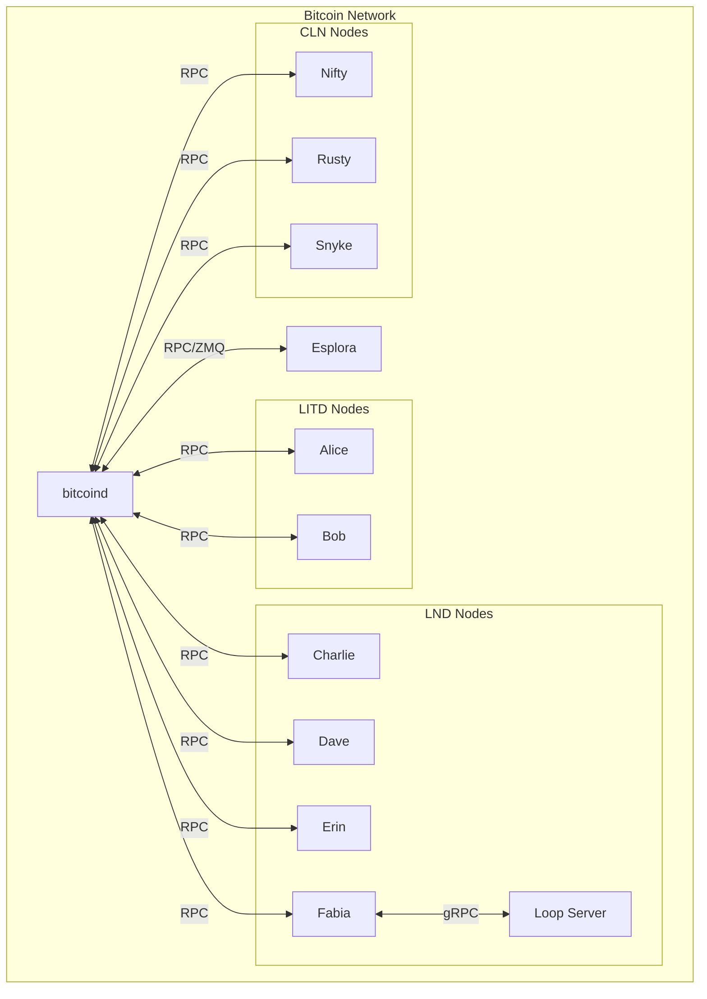

# Dockerized regtest setup

## Installation

* Clone the git repository and make sure the `regtest.sh` script is executable:

  ```shell
  # We assume this will be cloned to $HOME/rt.
  $ git clone git@github.com:guggero/rt.git
  $ chmod +x rt/regtest.sh
  ```
* (optional) create an alias for easy execution (might require `sudo`):
  ```shell
  $ ln -s $HOME/rt/regtest.sh /usr/local/bin/rt
  ```
* (optional) configure the script and make convenience alias commands usable.
  Add the following lines to your `~/.bashrc` file:
  ```shell
  # Where to store the data for all nodes. By default the data directory in this
  # project is used.
  export REGTEST_MOUNT_DIR=$HOME/rt/data
  
  # Make the aliases like reg_bitcoin available to any shell.
  source $HOME/rt/functions.sh
  ```

## Components

* `bitcoind` in regtest mode
  + Port(s): 18443 (RPC, regtest default), 28332,28333 (ZMQ)
* Esplora block explorer
  + Port(s): 3002 (web, default)
* 2 `litd` nodes:
  + Alice ports: 10011 (gRPC), 9741 (p2p), 8091 (REST), 8443 (lit)
  + Bob   ports: 10012 (gRPC), 9742 (p2p), 8092 (REST), 8444 (lit)
* 4 `lnd` nodes:
  + Charlie ports: 10013 (gRPC), 9743 (p2p), 8093 (REST)
  + Dave    ports: 10014 (gRPC), 9744 (p2p), 8094 (REST)
  + Erin    ports: 10015 (gRPC), 9745 (p2p), 8095 (REST)
  + Fabia   ports: 10016 (gRPC), 9746 (p2p), 8096 (REST)
* 3 `CLN` nodes:
  + Nifty ports: 9747 (p2p)
  + Rusty ports: 9748 (p2p)
  + Snyke ports: 9749 (p2p)
* 1 Loop server, connected to Fabia
  + Port(s): 11009 (gRPC)



## Usage

* `rt help`: Show available commands
* `rt info`: Show network information
* `rt fund <node> <x>`: Send `<x>` BTC to `<node>` on-chain
* `rt mine <x>`: Mine `x` blocks. If `x` is not specified, mines 6 blocks by default
* `rt start`: Start everything
* `rt restart`: Restart everything, completely wiping all data
* `rt stop`: Stop and remove everything
