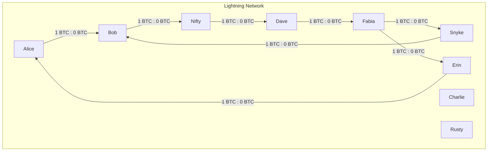

# Lightning Network hands-on exercise

Using the `rt` toolset and docker based local Bitcoin regtest setup, complete
the following tasks to familiarize yourself with the Lightning Network,
submarine swaps (using Lightning Lab's `loop` service) and Taproot Assets (using
Lightning Lab's `tapd` service).

Helpful resources:
 * Make sure to study the available commands of the lightning implementations:
    + `bitcoind` node: `rt bitcoin help`
    + `lnd` nodes: `rt <node> --help`
    + `litd` nodes:
       + `rt <node> --help` for interacting with the bundled `lnd` node
       + `rt <node>_litcli --help` for interacting with the bundled `litd`
          daemon
       + `rt <node>_loop --help` for interacting with the bundled `loop` daemon
    + `CLN` nodes: `rt <node> --help`
 * https://docs.lightning.engineering/lightning-network-tools/lnd/first-steps-with-lnd
 * https://github.com/ElementsProject/lightning/blob/master/doc/beginners-guide/opening-channels.md
 * https://github.com/ElementsProject/lightning/blob/master/doc/beginners-guide/sending-and-receiving-payments.md
 * https://docs.lightning.engineering/lightning-network-tools/lightning-terminal/introduction
 * https://docs.lightning.engineering/lightning-network-tools/loop/the-loop-cli
 * https://docs.lightning.engineering/lightning-network-tools/taproot-assets/first-steps

Hints:
 * Write down the commands you executed for each step or even create a script
   containing them. If something goes wrong and the network gets into a weird
   state, you can easily reset with `rt restart` and running all commands again.

# 1. Fund the nodes on the network

After starting up the `rt` docker environment, all nodes are ready for
interaction. But none of them have any funds in their internal wallets.
Study [the main README](README.md) to find out how to send 10 regtest BTC to
each node. Lightning Network channels can only be opened with confirmed on-chain
BTC available in the channel initiating/opening node.

# 2. Create channels to form a network

All nodes are already connected on a network level (e.g. a p2p connection is
already established between all of them by the setup script).
But there are no Lightning Network channels between the nodes yet.

Open 10 channels to establish the network as shown below. Make sure you open the
channels as public channels in order for them to be announced to the whole
network. Only public channels are known to all nodes in the network and can be
used for routing payments.

NOTE: An arrow pointing from node X to node Y means node X opens the channel to
Y, with all the initial balance on the side of X.

Sub tasks:
 - Create each individual channel to create the network shown above.
 - List the channels on some of the nodes to see some of their properties and
   confirm the initial balances.
 - Can you explain why the balances don't match the initial funding amount?

# 3. Send payment through network using an invoice

All the channels in the network are now very unbalanced, with all the liquidity
on the side of the channel opener. Looking at the graph above, payments can only
flow in one direction in certain parts of the network.

Shift the balances in some of the channels by doing a Lightning Network payment.
For example, if we assume Rusty is operating an online shop and Alice wants to
buy something from him, let's create an invoice for that and pay it.

Sub tasks:
 - Find out how to create an invoice on Fabia.
 - Find out how to pay the invoice on Alice.
 - Once the payment is successful, can you find out what path it took?
 - Confirm the channel balances on the nodes the payment went through.
 - How much was paid in fees? What nodes received routing fees?
 - What's the state of the invoice on Fabia after payment?
 - What's the state of the payment on Alice after it went through?

# 4. Send payment through the network with keysend

Fabia owes Bob a beer and wants to pay him back using Lightning. She knows Bob's
node public key and just does a Keysend payment (`--keysend`, see
`rt fabia sendpayment --help`).

Sub tasks:
 - Find out how to send a payment from Fabia to Bob without creating an invoice
   first.
 - What's the difference to a payment using an invoice?
 - What do the two nodes see in their invoices/payments?

# 6. Balance the channels using a circular payment

The channels are still quite unbalanced.

With a single payment, Alice can shift the balances of a lot of channels. She
can do that even without spending money (apart from a small routing fee), by
doing a so-called circular payment (`--allow_self_payment`, see
`rt alice sendpayment --help`).

Sub tasks:
 - Find out how to do a circular payment from Alice to herself.
 - Just from looking at the initial channel graph, what path do you expect the
   payment to take?
 - Can you confirm the payment actually took that route?
 - How much did Alice have to pay in fees?

# 6. Reduce hot wallet risk by looping out

Alice still has a large amount of Satoshi locked in her channel with Bob. She
feels like she wants to reduce the risk of keeping as many Satoshi in a channel.
And since she is operating an online shop, she mostly needs inbound capacity
anyway. So she decides to "loop" some of the funds out of her channel, to get
the funds back on-chain.

You can interact with the integrated Loop service through the `rt <node>_loop`
command.

Hint: The Loop service by default batches on-chain payments, so it can take up
to 30 minutes for a swap to be initiated. To request an immediate swap, you
might want to use the `--fast` flag.
Make sure to also use `rt alice_loop monitor` to check on the progres of the
swap. Some actions might need you to mine a block to proceed.

Sub tasks:
 - Find out how to use the Loop service integrated into `litd` on Alice's node
   to get a large portion of her channel outbound capacity back on-chain.
 - How many transactions did the loop involve?
 - How much in service fees did Alice have to pay?

# 7. Bonus: mint an asset on Alice

The two `litd` nodes Alice and Bob have the Taproot Assets Protocol daemon
`tapd` integrated, which means they are set up to be able to mint custom assets
and commit them into Lightning channels.

Make sure you give the [first steps
documentation](https://docs.lightning.engineering/lightning-network-tools/taproot-assets/first-steps)
a quick glance before proceeding.

You can interact with the integrated `tapd` service through the
`rt <node>_tapcli` command.

The price oracle that's set up in this regtest environment is configured to deal
with BTC to asset exchange rates measured in cents per BTC. Therefore, it is
recommended to mint the assets in a way that they represent fractions with two
decimal places (e.g. 100 cents in a dollar). That can be achieved by setting the
`--decimal_display 2` parameter when minting.

Sub tasks:
 - Find out how to mint your own USD/CHF/EUR token on Alice.
 - Inspect the minted token in the command line and the minting transaction in
   the block explorer.
 - Create a TAP address on Bob and send some of the minted asset units to Bob.

# 8. Bonus: create an asset channel between Alice and Bob, pay an invoice from Alice

Bob agrees to be a spot exchange for Alice, so she can spend her tokens over
Lightning through Bob, who converts the tokens to Satoshi on the fly. That means
Bob will be acting as an edge node, bridging Alice's token channel to the wider
BTC only Lightning Network.

Interacting with Taproot Assets and the Lightning Network, the special
`rt <node>_litcli ln` subcommand needs to be used.

The goal is to create an asset channel from Alice to Bob, then use that channel
to pay invoices or receive payments.

Sub tasks:
 - Create an asset channel between Alice and Bob, using
  `rt alice_litcli ln openchannel`.
 - Inspect the asset channel with `rt alice listchannels`, what's special about
   it?
 - Use assets to pay a BTC invoice from another node on the network (e.g. Snyke,
   Dave or Fabia). Make sure to use `rt alice_litcli ln payinvoice`.
 - How does the asset payment look like on Alice?
 - What exchange rate did Bob use to convert between assets and BTC?
 - What token/units did the receiver get?
 - Try the other way around: Create an asset based invoice on Alice (using
   `rt alice_litcli ln addinvoice`) and pay it with any other, BTC only node.
 - Is there anything special about the asset invoice?

