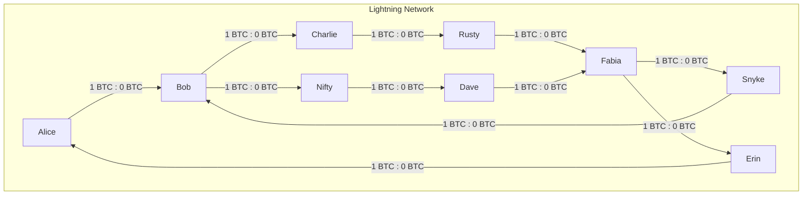

# Lightning Network hands-on exercise

Using the `rt` toolset and docker based local Bitcoin regtest setup, complete
the following tasks to familiarize yourself with the Lightning Network,
submarine swaps (using Lightning Lab's `loop` service) and Taproot Assets (using
Lightning Lab's `tapd` service).

Helpful resources:
 * Make sure to study the available commands of the lightning implementations:
    + `bitcoind` node: `rt bitcoin help`
    + `lnd` nodes: `rt <node> --help`
    + `litd` nodes:
       + `rt <node> --help` for interacting with the bundled `lnd` node
       + `rt <node>_litcli --help` for interacting with the bundled `litd`
          daemon
       + `rt <node>_loop --help` for interacting with the bundled `loop` daemon
    + `CLN` nodes: `rt <node> --help`
 * https://docs.lightning.engineering/lightning-network-tools/lnd/first-steps-with-lnd
 * https://github.com/ElementsProject/lightning/blob/master/doc/beginners-guide/opening-channels.md
 * https://github.com/ElementsProject/lightning/blob/master/doc/beginners-guide/sending-and-receiving-payments.md
 * https://docs.lightning.engineering/lightning-network-tools/lightning-terminal/introduction
 * https://docs.lightning.engineering/lightning-network-tools/loop/the-loop-cli
 * https://docs.lightning.engineering/lightning-network-tools/taproot-assets/first-steps

Hints:
 * Write down the commands you executed for each step or even create a script
   containing them. If something goes wrong and the network gets into a weird
   state, you can easily reset with `rt restart` and running all commands again.

# 1. Fund the nodes on the network

After starting up the `rt` docker environment, all nodes are ready for
interaction. But none of them have any funds in their internal wallets.
Study [the main README](README.md) to find out how to send 10 regtest BTC to
each node. Lightning Network channels can only be opened with confirmed on-chain
BTC available in the channel initiating/opening node.

# 2. Create channels to form a network

All nodes are already connected on a network level (e.g. a p2p connection is
already established between all of them by the setup script).
But there are no Lightning Network channels between the nodes yet.

Open 10 channels to establish the network as shown below. Make sure you open the
channels as public channels in order for them to be announced to the whole
network. Only public channels are known to all nodes in the network and can be
used for routing payments.

NOTE: An arrow pointing from node X to node Y means node X opens the channel to
Y, with all the initial balance on the side of X.

Sub tasks:
 - Create each individual channel to create the network shown above.
 - List the channels on some of the nodes to see some of their properties and
   confirm the initial balances.
 - Can you explain why the balances don't match the initial funding amount?

# 3. Send payment through network using an invoice

All the channels in the network are now very unbalanced, with all the liquidity
on the side of the channel opener. Looking at the graph above, payments can only
flow in one direction in certain parts of the network.

Shift the balances in some of the channels by doing a Lightning Network payment.
For example, if we assume Rusty is operating an online shop and Alice wants to
buy something from him, let's create an invoice for that and pay it.

Sub tasks:
 - Find out how to create an invoice on Rusty.
 - Find out how to pay the invoice on Alice.
 - Once the payment is successful, can you find out what path it took?
 - Confirm the channel balances on the nodes the payment went through.
 - How much was paid in fees? What nodes received routing fees?
 - What's the state of the invoice on Rusty after payment?
 - What's the state of the payment on Alice after it went through?

# 4. Send payment through the network with keysend

Fabia owes Bob a beer and wants to pay him back using Lightning. She knows Bob's
node public key and just does a Keysend payment (`--keysend`, see
`rt fabia sendpayment --help`).

Sub tasks:
 - Find out how to send a payment from Fabia to Bob without creating an invoice
   first.
 - What's the difference to a payment using an invoice?
 - What do the two nodes see in their invoices/payments?

# 6. Balance the channels using a circular payment

The channels are still quite unbalanced.

With a single payment, Alice can shift the balances of a lot of channels. She
can do that even without spending money (apart from a small routing fee), by
doing a so-called circular payment (`--allow_self_payment`, see
`rt alice sendpayment --help`).

Sub tasks:
 - Find out how to do a circular payment from Alice to herself.
 - Just from looking at the initial channel graph, what path do you expect the
   payment to take?
 - Can you confirm the payment actually took that route?

# 6. Reduce hot wallet risk by looping out

# 7. Bonus: mint an asset on Alice
# 8. Bonus: create an asset channel between Alice and Bob, pay an invoice from Alice